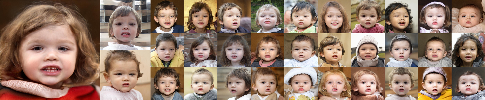

## FSGAN Official TensorFlow Code



**Few-Shot Adaptation of Generative Adversarial Networks**<br>
Esther Robb, Vincent Chu, Abhishek Kumar, Jia-Bin Huang<br>

Paper: <br>
Website: https://e-271.github.io/few-shot-gan<br>

Generative Adversarial Networks (GANs) have shown remarkable performance in image synthesis tasks, but typically require a large number of training samples to achieve high-quality synthesis.
This paper proposes a simple and effective method, Few-Shot GAN (FSGAN), for adapting GANs in few-shot settings (less than 100 images). 
FSGAN repurposes component analysis techniques and learns to adapt the singular values of the pre-trained weights while freezing the corresponding singular vectors. 
This provides a highly expressive parameter space for adaptation while constraining changes to the pretrained weights. 
We validate our method in a challenging few-shot setting of 5-100 images in the target domain. 
We show that our method has significant visual quality gains compared with existing GAN adaptation methods. 
We report qualitative and quantitative results showing the effectiveness of our method. 
We additionally highlight a problem for few-shot synthesis in the standard quantitative metric used by data-efficient image synthesis works.

## Requirements

Our code is build on StyleGAN2 with no additional requirements. You can follow their directions here: [StyleGAN2 Requirements](https://github.com/NVlabs/stylegan2#requirements).

## Preparing datasets

To prepare a dataset from a folder containing images:

```
python dataset_tool.py \
create_from_images \
/path/to/target/tfds \
/path/to/source/folder \
--resolution 1024
```

The flag `resolution` is used to resize images to a new size, e.g. 1024x1024.

## Training networks

Our networks start with pretrained checkpoint pickle from vanilla StyleGAN2 `config-f`, which can be downloaded from Drive here: [StyleGAN2 Checkpoints](https://drive.google.com/corp/drive/folders/1yanUI9m4b4PWzR0eurKNq6JR1Bbfbh6L)

First download the pretrain pickle and creating train/eval datasets.

Then train FSGAN (our method) using this command:

```
python run_training.py \
--config=config-ada-sv-flat \
--data-dir=/path/to/datasets \
--dataset-train=path/to/train \
--dataset-eval=path/to/eval \
--total-kimg=30 \
--metrics=None
```

Other values of `config` correspond to SSGAN `config-ss`, FreezeD `config-fd`, and TransferGAN `config-f`.


## Image generation

To generate additional samples from a pretrained model:

```
python run_generator.py generate-images --network=/path/to/network/pickle --seeds=0-100
```

## Pretrained networks

We provide some pretrained network checkpoints in Drive: [Few-Shot GAN Checkpoints](https://drive.google.com/drive/folders/1uRwA-HspeoQF9k-6AmotEtCH7tsFTjHI?usp=sharing)

## License

As a modification of the official StyleGAN2 code, this work inherits the Nvidia Source Code License-NC. To view a copy of this license, visit https://nvlabs.github.io/stylegan2/license.html

## Citation

If you find this project useful, please cite this work:

```
@article{robb2020fsgan,
  title   = {Few-Shot Adaptation of Generative Adversarial Networks},
  author  = {Esther Robb and Wen-Sheng Chu and Abhishek Kumar and Jia-Bin Huang},
  journal = {arXiv},
  year    = {2020},
}
```
